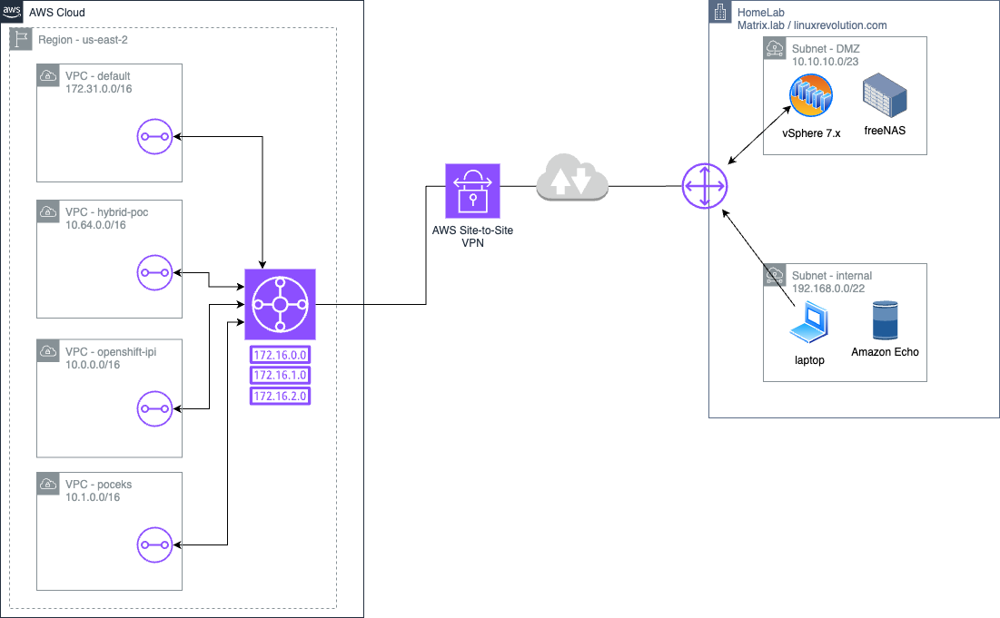

# README

## Purpose
This Repo details creating a Hybrid Network Model which includes AWS Transit Gateway + VPN site-to-site connection.

4 x VPCs
1 x "Corporate Data Center" with 2 x subnets (internal and DMZ)

